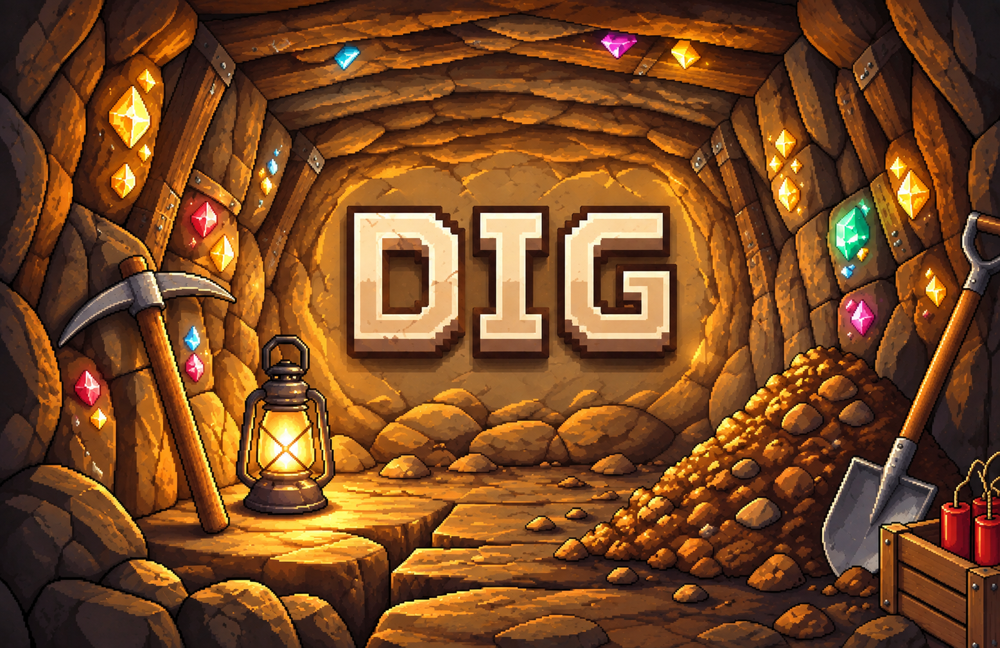
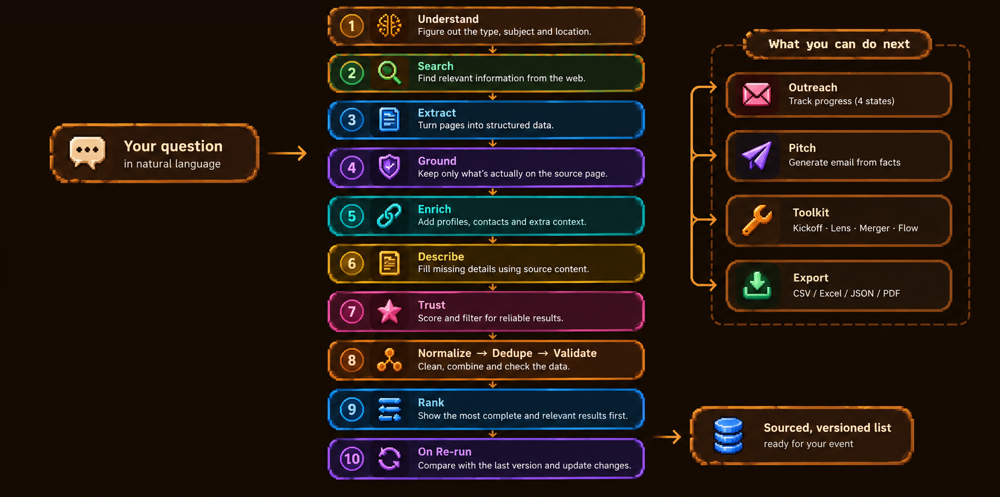
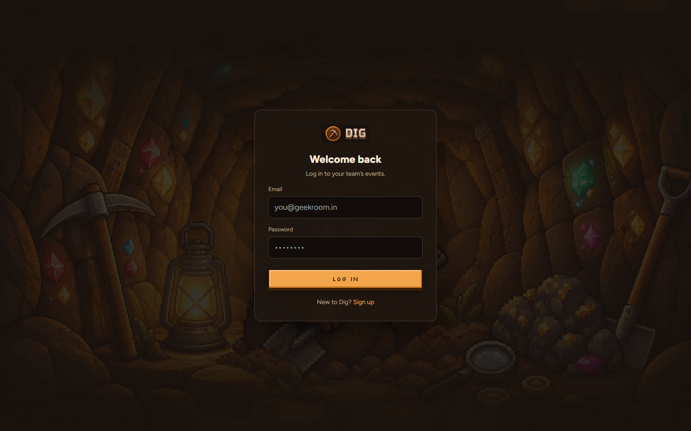
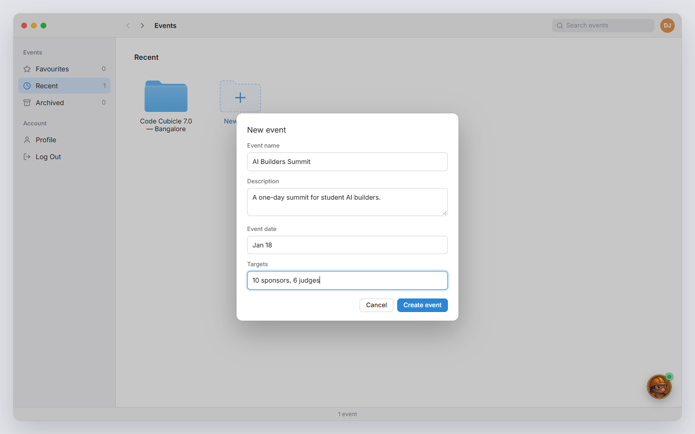
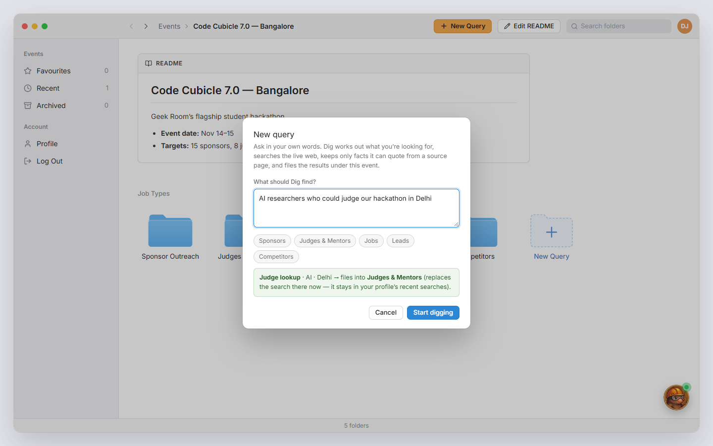
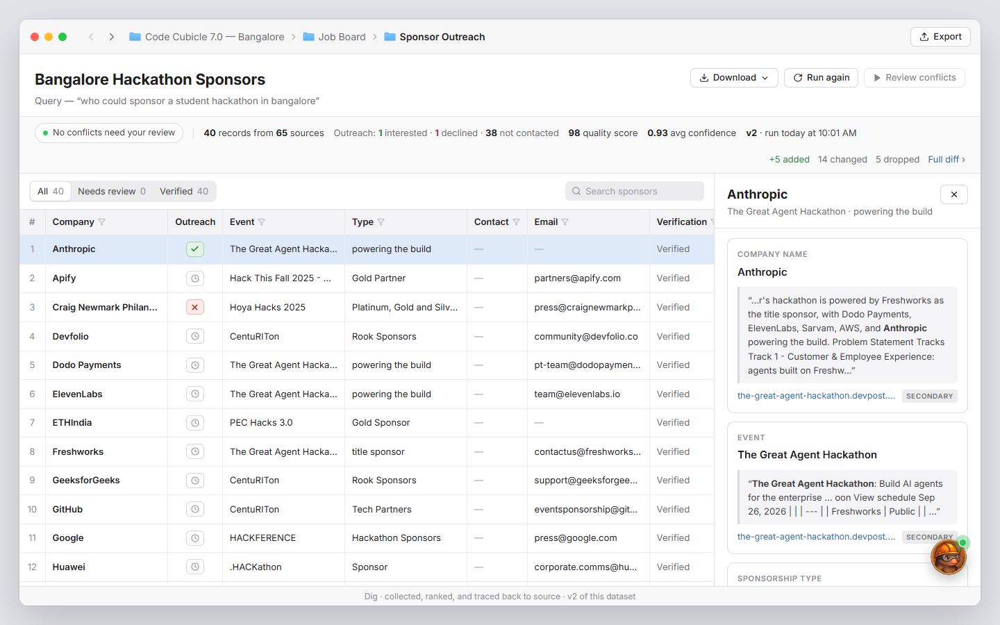
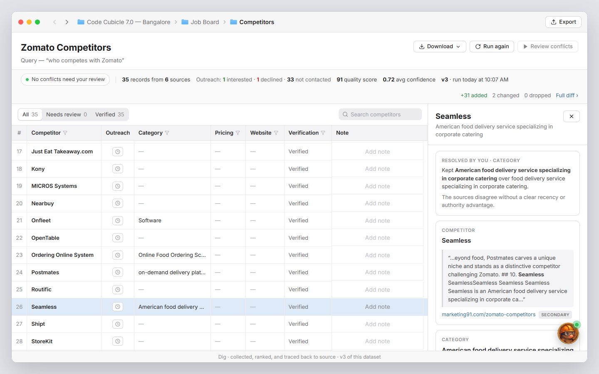
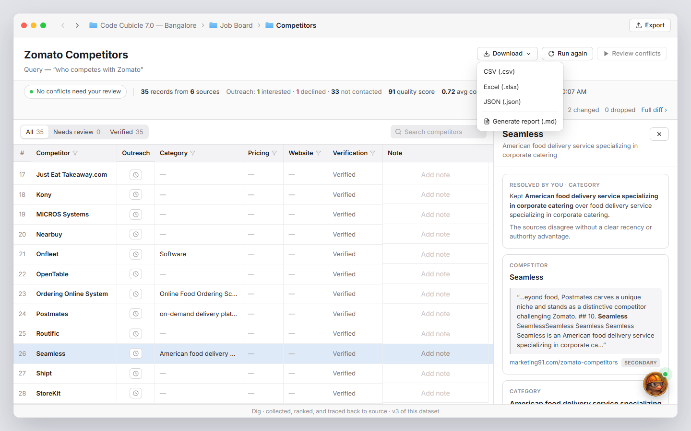

<div align="center">




[]()
[]()
[]()
[](LICENSE)


### We dig the internet for you, so you don't have to

Sponsors, judges, speakers — found, sourced, and organized into one space, so your whole team can focus on running the event instead of manually hunting for contacts.

**[▶ Watch the demo](https://youtu.be/wxyIEdSFLwU)** · **[Try it live](https://dig-ai.vercel.app/)** · **[Full feature guide](Features.md)**

</div>

## Table of contents

- [The problem](#the-problem)
- [What you get](#what-you-get)
- [What's new in version 2](#whats-new-in-version-2)
- [How it works](#how-it-works)
- [Tech stack](#tech-stack)
- [Using Dig](#using-dig)
- [Getting started](#getting-started)
- [Prototype notes](#prototype-notes)
- [Vision](#vision)
- [The team](#the-team)


## The problem

Finding the right sponsor, mentor, judge, or lead still means hours of manual digging — tab after tab, list after list, hoping the sheet you're copying into isn't already out of date.

Everyone starts the same way, and it never gets faster: search Google for the obvious names, then go site by site — Unstop, HackerEarth, Devfolio — checking who's actually sponsoring right now. Hours later, you have a spreadsheet. Often it's just last year's list, copied forward, with no way to tell which sponsors have quietly dropped out or which contacts have since moved on. Nobody rechecks it, because rechecking means doing the whole search again.

The alternative isn't better. Ask a chatbot instead, and you get a fast, confident answer — with no source, no date, and no way to check if that email still works.

**Dig does the digging. You just ask.** Ask a question in plain language and it runs a real research pipeline: web searches matched to your intent, extracted into structured fields, and checked line by line against the page they came from. Every result is something you can click through and verify yourself — and re-running it later doesn't rebuild the list from scratch, it tells you exactly what changed.


## What you get

| | |
|---|---|
| **Every event, organized** | Sponsors, judges & speakers, jobs, leads and competitors — one folder each, per event. |
| **Sourced, not guessed** | Every value traces back to the page it came from. Emails are never guessed. |
| **Contacts you can use** | LinkedIn, GitHub and work emails, matched by name *and* organisation. |
| **Never stale** | Re-run a list anytime and see exactly what was added, changed or not found again. |
| **Conflicts, resolved for you** | Clear changes are settled automatically. Dig only asks you when it's genuinely unsure. |
| **Work the list** | Track outreach in four states, keep team notes, and draft a first email from sourced facts. |
| **Toolkit** | Plan an event against its deadline, see insights per list, merge lists, sketch outreach. |
| **Export and go** | CSV, Excel, JSON, or a plain black-and-white PDF report. |


## What's new in version 2

Built on the feedback from the online round:

- **Contacts, not just names.** A contact-finding step after research adds LinkedIn, GitHub and work emails (Hunter.io), only when the name and organisation match. On our speakers list, LinkedIn went from 0 to most of the list.
- **No more empty columns.** "What they do" and "Expertise" are filled from the person's or company's own page, copied word for word and cited.
- **Another contact.** For sponsors and leads, add the next person at a company when the first one doesn't reply.
- **Most complete rows first**, and obvious conflicts settled automatically.
- **Outreach in four states** (Not contacted, Waiting, Interested, Declined), **Pitch** emails from sourced facts, and a professional PDF report.
- **Toolkit:** Kickoff (event planner), Lens (insights), Merger (combine lists) and Flow (outreach sketch).
- **Plain-language help** on every button and column.

The full list is in the [feature guide](Features.md).


## How it works

<p align="center"></p>

1. **Understand** — an LLM picks the kind of search, the subject and the place.
2. **Search** — several web searches suited to that kind of search.
3. **Extract** — pages become structured rows.
4. **Ground** — a value is kept only if it's on its source page, word for word.
5. **Enrich** — LinkedIn, GitHub and work emails, matched by name and organisation.
6. **Describe** — empty "What they do" / "Expertise" filled from the subject's own page, cited.
7. **Trust** — Jev helps score how far to trust each row.
8. **Normalize, dedupe, validate** — clean, merge duplicates, check every field.
9. **Rank** — the most complete rows first.
10. **On re-run** — compare with the last version: clear changes settle automatically, real disagreements are flagged for you.


## Tech stack

**Runtime**
`TypeScript` · `Node.js` · `Express` · `SQLite` · `Zod`

**Frontend**
`React` · `Vite` · `Tailwind CSS` · `TanStack Query` · `TanStack Table` · `React Router` · `jsPDF`

**Research pipeline**
`Tavily` (search) · `Groq` (extraction & reasoning) · `Hunter.io` (work emails) · `GitHub API` (profiles) · `Jev via OpenRouter` (trust decisions)

**Testing**
`Vitest`


## Using Dig

**1. Sign up and log in**
Create an account to get your own workspace — every event and search you run is saved to it.

<p align="center"></p>

**2. Create an event**
Every search lives inside an event — a hackathon, a conference, a talk. Its README holds the dates, targets and deadlines, and is used when drafting pitches.

<p align="center"></p>

**3. Ask your question**
Inside the event, click **Got Something Else?** and ask in plain language. Dig works out what you're looking for and files the results into the matching folder.

<p align="center"></p>

**4. Review sourced results**
Every row links to its source. The most complete rows come first, with LinkedIn, GitHub and email where they were found. Mark each row Not contacted, Waiting, Interested or Declined, leave a note, and use **Pitch** to draft a first email or **Another** to find a second person at the same company.

<p align="center"></p>

**5. Re-run and resolve conflicts**
Run the same search again later. Dig settles what it's confident about and only asks you when a source disagrees and it can't tell why.

<p align="center"></p>

**6. Export, or open the Toolkit**
Download the results as CSV, Excel, JSON or a PDF report. Or open **Toolkit**: plan the event with Kickoff, read a list's insights in Lens, or combine lists in Merger.

<p align="center"></p>


## Getting started

**Try it live:** [dig-ai.vercel.app](https://dig-ai.vercel.app/) — sign up, create an event, and ask your first question.

**Watch the demo:** [youtu.be/wxyIEdSFLwU](https://youtu.be/wxyIEdSFLwU)

**Or run it locally:**

Requirements: Node.js 22.13+ (24 recommended — see `.nvmrc`)

```bash
git clone https://github.com/ashima19arora/Dig.git
cd Dig
npm install

cp .env.example .env
# Required in .env:
#   TAVILY_API_KEY=...          (web search — tavily.com)
#   LLM_PROVIDER=groq
#   LLM_API_KEY=...             (console.groq.com)
#   LLM_MODEL=openai/gpt-oss-120b
# Optional (Dig falls back gracefully without them):
#   LLM_EXTRA_MODELS=openai/gpt-oss-20b   (a second model with its own rate limit)
#   GROQ_API_KEY_FALLBACK=...             (backup Groq keys, up to 5)
#   HUNTER_API_KEY=...                    (work emails — hunter.io, free plan 50/month)
#   HUNTER_MAX_CALLS_PER_RUN=8
#   GITHUB_TOKEN=...                      (GitHub profile lookups)
#   JEV_API_KEY=...                       (trust decisions — an OpenRouter key)
#   ENRICHMENT_TIMEOUT_MS=60000

npm run dev
```

Open [localhost:5173](http://localhost:5173), sign up, and start digging. Your account, events and results are stored in `data/dig.db` and survive restarts.

This starts the API and web app together — the web app on Vite's dev server, the API on Express with `tsx watch`. Run the tests with `npm test` and type-check with `npm run typecheck`.

### Deploying

- **API → [Railway](https://railway.app)** (a normal always-on Node server, so live searches can run in the background). Build from the repo root with start command `npm run db:migrate && npm start -w @dig/api`, attach a volume at `/data`, and set `DATABASE_PATH=/data/dig.db` plus the keys above. The database upgrades itself on start; it only ever adds tables and columns.
- **Web → [Vercel](https://vercel.com)** from the repo root — build settings live in `vercel.json`, which also forwards `/api/*` to the Railway API, so the site and API share one domain and need no extra environment variables.


## Prototype notes

Dig is a hackathon prototype. Two parts are deliberately mockups:

- **Flow** draws and runs an outreach plan and pauses for your approval, but **does not send** emails or messages.
- **Pricing checkout** shows the payment flow, but **no payment is processed**; choosing a plan doesn't charge you.

Search results also vary a little between runs, because the pages the web search returns change.


## Vision

Sponsors, mentors, judges — that's where Dig starts, but the problem it solves isn't specific to events. Anyone who has to turn a question into a trustworthy list is doing the same fifteen-tabs research by hand. Dig is built to be the one engine underneath all of it:

- **Event teams** — sponsors, judges, and mentors, sourced, not scraped from an old sheet.
- **Students** — course comparisons by price and content, pulled fresh instead of copied from a forum post.
- **Job seekers** — openings that are actually live right now, not a listing three months stale.
- **Sales teams** — lead lists that don't rot the week after you build them.
- **Researchers** — facts with a citation attached, not a chatbot's best guess.

Same pipeline, same grounding, same trust — just pointed at whatever you're digging for next.


## The team

Built by **Mayank** and **Ashima**, four days, one monorepo, and more coffee breaks than either of us will admit to. The full build, failure by failure, is in the [Dev Log](https://dig-ai.vercel.app/dev-log).

<div align="center">

made with ❤️ at Code Cubicle 6.0

</div>
